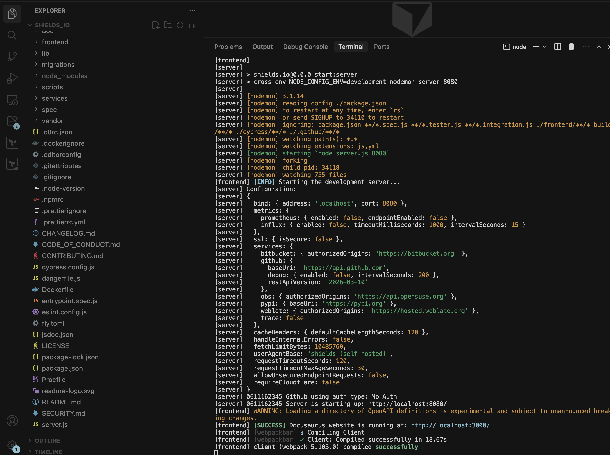
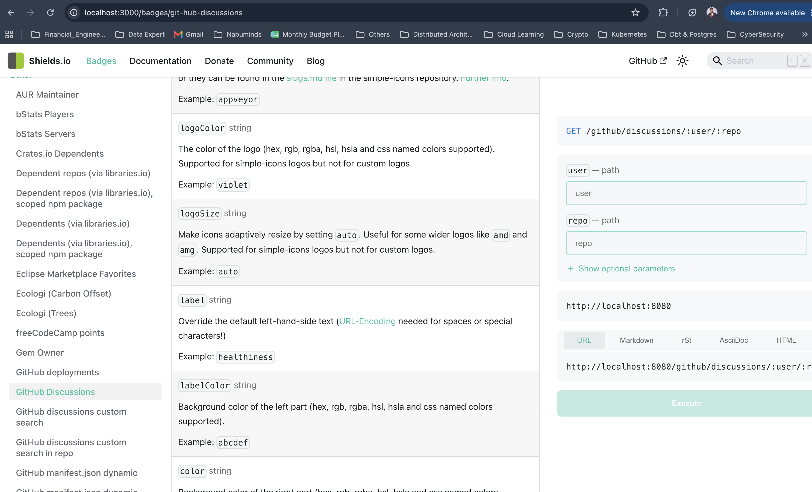
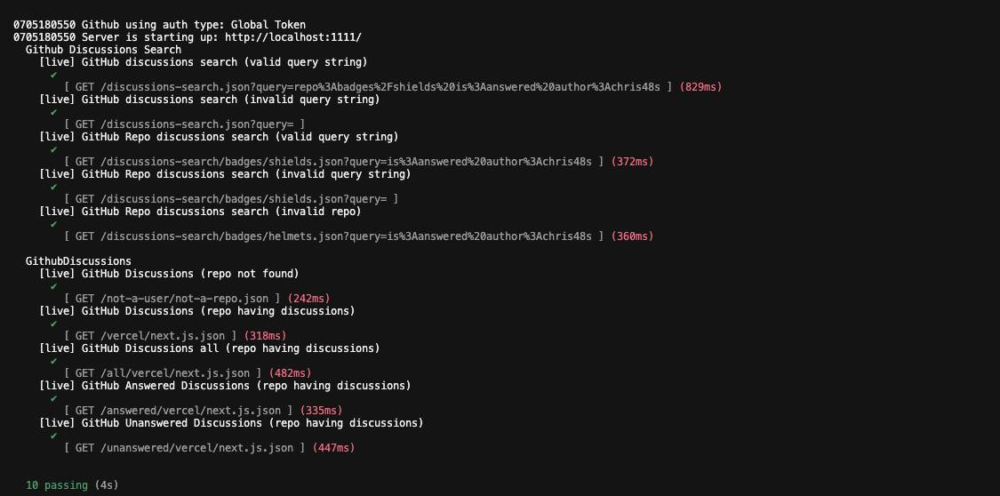

# Contribution 1: Badge request: GitHub Discussions

**Contribution Number:** 1  
**Student:** Adewale Olamide Adesoba  
**Issue:** https://github.com/badges/shields/issues/6047  
**Status:** Phase IV Completed

---

## Why I Chose This Issue

Having used shield.io in the past to make my github profile page colorful and my clear understanding of the issue together with the undelaying technology powering this open source tool like  calling the github api and consuming the response, also the ease of reproducing the issue i hope to confidently add this feature and improve my open source contribution skillset. 

---

## Understanding the Issue

### Problem Description

Issue [#6047](https://github.com/badges/shields/issues/6047) is a feature enhancement for shields.io's existing GitHub Discussions badge. Users can already display the total number of discussions for a repository, but there is no way to show how many of those discussions have been answered or are still unanswered. Since GitHub's API now supports filtering discussions by answered status, shields.io should expose those counts as badge variants so README authors and profile pages can surface more useful discussion metrics without building custom integrations.

### Expected Behavior

The existing GitHub Discussions badge should be extended with two path variants on the same endpoint:

- **Total (existing):** `/github/discussions/:user/:repo` — returns the total discussion count (e.g. `28406 total`)
- **Answered:** `/github/discussions/:user/:repo/answered` — returns only answered discussions (e.g. `5167 answered`)
- **Unanswered:** `/github/discussions/:user/:repo/unanswered` — returns only unanswered discussions (e.g. `16696 unanswered`)

Each variant should render as a distinct badge (label + count + colour), follow the same service/tester patterns as other GitHub badges in the project, include unit tests for URL construction, transform, and render logic, and be documented in the frontend so users can discover and copy the new badge URLs. The original total badge must continue to work unchanged.

### Current Behavior

Currently only the total number of discussion of the discussion badge is available

### Affected Components

Discussion badge
https://github.com/badges/shields/tree/master/services/github

---

## Reproduction Process

### Environment Setup

I cloned the master repository, updated my node package manager and ran the required the commands to start the server on my local computer, the only issue was just updating my node package manager as the current version was not compartible with the recommended version from the source repository

Working branch: https://github.com/OLAMIDE100/shields/tree/add-discussion-variants

### Steps to Reproduce

1. git clone master branch
2. update node to 22
3. Run npm ci to install the dependencies.
4. Run npm start to start the badge server and the frontend dev server.
5. Open http://localhost:3000/ to view the frontend.
6. Navigate to others, then click github discussion under 

### Reproduction Evidence

- **Screenshots/logs:** 

- **My findings:** The answered and the unanswered variant of the discussion section is not yet available

---

## Solution Approach

### Analysis

From my analysis the last time the section was updated, the api for loading the data for this section was not yet available in github

### Proposed Solution

Add the discussion variants by add codes both for backend and frontend to make this effective

### Implementation Plan

Using UMPIRE framework (adapted):

**Understand:** The solution will be an extention of the already existing github discussion badge to cover its total answered and unanswered variants.

**Match:** We already have the github discussion badge code for both frontend and backend

**Plan:** 

1. test the api to understand the response and how to properly load them
2. add the frontend and backend code
2. add unit test 

**Implement:** https://github.com/OLAMIDE100/shields/tree/add-discussion-variants

**Review:** Will self-review against project CONTRIBUTING.md and 
commit message conventions before opening PR.

**Evaluate:** check that the github discussion total answered and unanswered variant areseen in my local environment while reproducing and all test associated with them pass successfully

---

## Testing Strategy

### Unit Tests

- [x] Test Case 1: Total badge unchanged — existing `/github/discussions/:user/:repo` path still returns the total discussion count; confirms the feature is backward compatible
- [x] Test Case 2: Answered variant URL — `/answered` path segment is parsed correctly and builds the right GitHub API query for answered discussions
- [x] Test Case 3: Unanswered variant URL — `/unanswered` path segment is parsed correctly and builds the right GitHub API query for unanswered discussions
- [x] Test Case 4: Answered variant render — badge label shows `answered` and the count from the API response is displayed in the message
- [x] Test Case 5: Unanswered variant render — badge label shows `unanswered` and the count from the API response is displayed in the message
- [x] Test Case 6: Transform logic — API response is mapped to the correct numeric count for each variant (total, answered, unanswered)
- [x] Test Case 7: Invalid or missing repository — returns an appropriate error/inaccessible badge when the repo does not exist
- [x] Test Case 8: Repository with no discussions — handles a valid repo that returns zero discussions without breaking render logic
- [x] Test Case 9: Total variant render — badge label shows `total` and existing render behaviour is preserved for the default path

All 9 cases run with `npm run test:services -- --only=GithubDiscussions` — no live GitHub token required; the service tester mocks API responses for URL construction, transform, and render checks.

### Integration Tests

- [x] Full service test suite — `npm run test:services -- --only=GithubDiscussions` passes all 9 cases against mocked responses
- [ ] Live GitHub API with authentication token — verified partially; local calls failed without a token configured, so live integration relied on manual badge-server testing (see below)

### Manual Testing

1. I cloned the shields.io repo, upgraded to Node 22, and ran `npm ci` to install dependencies.
2. I started the dev environment with `npm start` — badge server on `http://localhost:8080` and frontend on `http://localhost:3000`.
3. I opened the total badge URL (`/github/discussions/vercel/next.js`) and confirmed it rendered **28406 total** (blue badge).
4. I then tested the answered variant (`/github/discussions/vercel/next.js/answered`) and confirmed it rendered **5167 answered** (green badge).
5. I tested the unanswered variant (`/github/discussions/vercel/next.js/unanswered`) and confirmed it rendered **16696 unanswered** (orange badge).
6. I captured screenshots in `testing/testing.md` and `images/results.png` as evidence that all three variants work end-to-end locally.

---

## Implementation Notes

### Week 3 Progress

**What I built:**
- Setup the example files in the service folder to foster my practical knowledge on how it works in development environment
- Added 2 services:
  - service 1: get the total count of answered github repository discussion
  - service 2: get the total count of answered github repository discussion
- Added 2 test:
  - Test 1: repo exist
  - Test 2: repo have discussion
- Update the frontend pointing to the documentation
- All existing tests still pass (ran full test suite)

**Challenges faced:**
- **Node version incompatibility** — My local Node version was older than the version required by the shields.io repo, which blocked `npm ci` and the dev server until I upgraded to Node 22.
- **Missing GitHub token locally** — Without a token configured, live API calls returned auth errors during manual testing. I had to rely on the service tester mocks to verify URL, transform, and render logic while debugging.
- **Understanding the service pattern** — shields.io badges follow a specific `*.service.js` / `*.tester.js` structure. Reading the existing example files in the service folder was necessary before I could add the answered and unanswered variants correctly.
- **GitHub API filtering** — Figuring out how to query discussion counts by answered/unanswered status took time; the API support for these filters was newer than when the original total badge was written.
- **Telling apart setup errors from code bugs** — Early failures from environment and auth issues looked similar to implementation mistakes, so I learned to check Node version, token config, and test output before changing service logic.

**Commits this week:**
- https://github.com/badges/shields/commit/e0251485afd3a470e092022c2c951d635e07fdfb: added both the service and tester for both the answered and unanswered variant of  github discussion

### Week 4 Progress

## Pull Request 

**PR Link:** https://github.com/badges/shields/pull/11951

**PR Description:** 

Add the variant badge of github discussion (answered/unanswered) together with its test and documentation

Closes  https://github.com/badges/shields/issues/6047

## Badge endpoint

`/github/discussions/:user/:repo`
`/github/discussions/:user/:repo/answered`
`/github/discussions/:user/:repo/unanswered`

Examples:
- Total: `/github/discussions/vercel/next.js`
- Answered: `/github/discussions/vercel/next.js/answered`
- Unanswered: `/github/discussions/vercel/next.js/unanswered`

## Implementation

- `services/github/github-discussions.service.js` — extended to support `/answered` and `/unanswered` path variants alongside the existing total count; fetches filtered discussion counts from the GitHub API
- `services/github/github-discussions.tester.js` — unit tests for URL construction, transform, and render logic for all three variants (total, answered, unanswered)
- Frontend documentation — updated badge listing and examples so users can discover the new variants

## Tests

- `npm run test:services -- --only=GithubDiscussions` — 9/9 passing
- Manual verification — all three badge variants confirmed locally at `http://localhost:8080` (see `testing/testing.md` and `images/results.png`)

**Maintainer Feedback:**

- 28/06/2026: Pull request name update to enable automated ci testing

**Status:** Iterating

---

## Learnings & Reflections

This contribution took me from reading an open-source feature request to shipping a working PR against a real project with its own conventions, test harness, and maintainer review process. The most valuable lesson was not writing new code from scratch, but learning to extend an existing service the way shields.io already does  path variants on a single badge endpoint rather than duplicating services. I also learned that open-source work does not end when the code works locally; documenting the change clearly, passing the project's test suite, and responding to maintainer feedback (such as the PR title change for CI) are part of the contribution itself. Patience was required while waiting for maintainer review, but that waiting time was useful for refining the PR description, capturing screenshots, and making sure the test evidence was easy for reviewers to verify.

### Technical Skills Gained

- **shields.io service architecture** — How badge services are structured (`*.service.js` for API fetch/transform/render and `*.tester.js` for unit tests), and how to extend an existing badge instead of creating a parallel one.
- **GitHub Discussions API** — How to query discussion counts filtered by answered/unanswered status and map the response into badge-friendly values.
- **Local development workflow** — Cloning the repo, upgrading to Node 22, running `npm ci`, starting the badge server (`localhost:8080`) and frontend dev server (`localhost:3000`), and manually verifying badge output.
- **Service unit testing** — Writing and running targeted tests with `npm run test:services -- --only=GithubDiscussions`, covering URL construction, transform logic, and render output (9 passing tests for the final implementation).
- **Open-source PR workflow** — Opening a PR against `badges/shields`, linking to issue #6047, structuring the description around what/why/acceptance criteria, and attaching visual evidence of the working badges.
- **Technical writing** — Documenting endpoints, file changes, and test results in `testing/summary.md` so reviewers and course evaluators can follow the work without reading the full diff.

### Challenges Overcome

- **Node version mismatch** — The project's recommended Node version was newer than what I had installed locally. Upgrading to Node 22 was required before `npm ci` and the dev server would run reliably.
- **Missing GitHub token locally** — Without a token configured, API calls failed during local development. I worked through this by understanding which errors were auth-related versus logic bugs, and verifying behaviour through the service tester mocks rather than relying only on live API calls.
- **Aligning with project patterns** — My first approach considered separate service files for answered and unanswered variants. After studying the existing `github-discussions` badge, I refactored to path variants (`/answered`, `/unanswered`) on the same endpoint, which is cleaner and matches how other GitHub badges in the codebase work.
- **Maintainer CI feedback** — A maintainer asked for a PR title update so automated CI could run correctly. This was a small change, but it reinforced that upstream projects have tooling expectations that are easy to miss on a first contribution.
- **Embedding screenshots in GitHub** — Images linked via `/blob/` URLs do not render in PR conversations; they must use `raw.githubusercontent.com` URLs, relative paths within the same repo, or GitHub's drag-and-drop upload (`user-attachments`).

### What I'd Do Differently Next Time

- **Read one existing similar service end-to-end before writing code** — Studying `github-discussions.service.js` and its tester first would have saved time compared to initially planning separate service files.
- **Set up a GitHub token on day one** — Configuring authentication early would have made local manual testing smoother and reduced confusion between API errors and implementation bugs.
- **Use the structured PR template from the start** — Writing the what/why/acceptance-criteria format in `testing/summary.md` before opening the PR would have made the initial submission stronger and reduced rework on the description.
- **Capture screenshots as I go** — I verified badges in the browser but consolidated screenshots later; saving evidence after each milestone (setup, first passing test, all three variants working) would make documentation easier.
- **Run the targeted test command after every change** — Using `npm run test:services -- --only=GithubDiscussions` incrementally is faster than waiting until the end to discover a regression.

---

## Resources Used

- [shields.io GitHub repository](https://github.com/badges/shields) — Main project codebase, CONTRIBUTING guidelines, and existing GitHub service examples under `services/github/`
- [Issue #6047 — GitHub Discussions answered/unanswered badge request](https://github.com/badges/shields/issues/6047) — Original feature request that defined the scope of this contribution
- [PR #11951](https://github.com/badges/shields/pull/11951) — My pull request for the answered and unanswered discussion badge variants
- [Working branch: add-discussion-variants](https://github.com/OLAMIDE100/shields/tree/add-discussion-variants) — Fork branch where the implementation was developed
- [Commit e0251485](https://github.com/badges/shields/commit/e0251485afd3a470e092022c2c951d635e07fdfb) — Initial commit adding service and tester code for the discussion variants
- [GitHub REST API — Discussions](https://docs.github.com/en/rest) — Reference for querying repository discussion data and understanding filter parameters
- Local project files in this folder — `testing/summary.md` (PR description and acceptance criteria), `testing/testing.md` (live badge verification), and screenshots under `images/` used as reproduction and completion evidence

